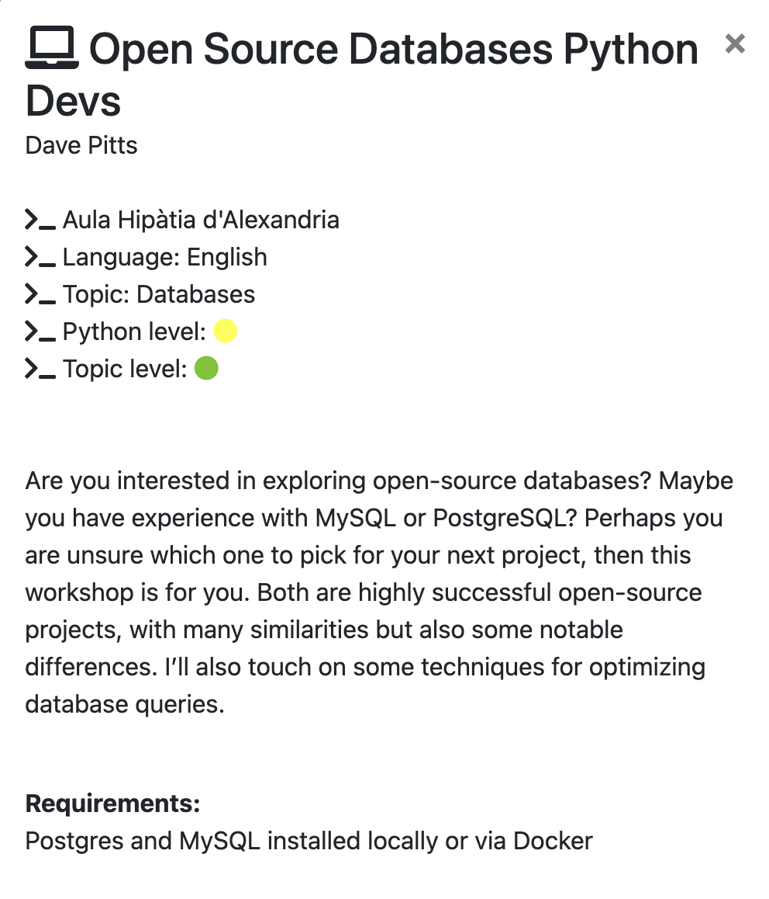

## Welcome to my pyDay Barcelona 2024 talk on my Favorite 💚 :green_heart: Open Source :free: databases  !!



!!! DoN't :free: P@nIc !!!

This is what I thought I was presenting:

> I’ll be presenting on open-source database options for Python developers. While I’m personally a big fan of PostgreSQL, I’ll also be covering other popular choices, including MySQL, SQLite, Redis, and Cassandra. The session will include demos and hands-on exercises, so ideally, you should have PostgreSQL, MySQL, SQLite, and Redis installed locally or running via Docker. I’ll also discuss ORMs, with a focus on SQLAlchemy.


This is what I [found in the schedule](https://pybcn.org/events/pyday_bcn/pyday_bcn_2024/) on Thursday morning:

> Are you interested in exploring open-source databases? Maybe you have experience with MySQL or PostgreSQL? Perhaps you are unsure which one to pick for your next project, then this workshop is for you. Both are highly successful open-source projects, with many similarities but also some notable differences. I’ll also touch on some techniques for optimizing database queries.


then I got sick and almost better again... but don't panic, 
last night I got my shit together and hopefully a decent presetation?

Time will tell ...


## Prerequisites

```
   24  pip install cassandra-driver
   27  pip install psycopg2 pandas

   38  pip install psycopg2-binary
----
    1  docker pull cassandra
    2  docker run --name my-cassandra -d -p 9042:9042 cassandra
    3  docker logs my-cassandra
   10  docker exec -it my-cassandra cqlsh\n
----
   12  docker ps
   13  docker stop my_postgres\n
   14  docker rm my_postgres\n
   15  docker run --name my_postgres -e POSTGRES_PASSWORD=mysecretpassword -p 5432:5432 -d postgres\n
   18  docker stop my_postgres\n
   19  docker rm my_postgres\n
   20  docker run --name my_postgres -e POSTGRES_PASSWORD=mysecretpassword -p 5432:5433 -d postgres\n
   21  docker stop my_postgres\n
   22  docker rm my_postgres\n
   23  docker run --name my_postgres -e POSTGRES_PASSWORD=mysecretpassword -p 5433:5432 -d postgres\n
   24  docker exec -it my_postgres psql -U postgres
----

----
----
----
----


```


